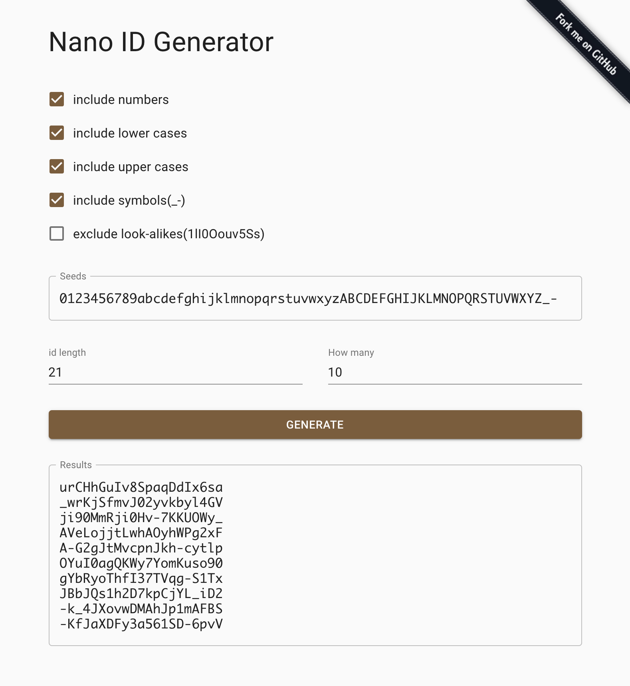

[Nano ID](https://github.com/ai/nanoid) is a string random ID with the following features.

- **Small**. Only 108 bytes
- **Fast**. It is 60% faster than UUID.
- **Safe**. It uses cryptographically strong random APIs. Can be used in clusters.
- **Compact**. It uses a larger alphabet than UUID (A-Za-z0-9\_-). So ID size was reduced from 36 to - **21** symbols.
- **Portable**. Nano ID was ported to 14 programming languages.

I often need some random Nano IDs during development but such an online service did not seem to exist. So I created a [Nano ID generator](https://nanoid.yuuniworks.com/) that generates multiple NanoIDs with preset seeds (lowercase, uppercase, numbers, etc.). I hope this helps someone.

