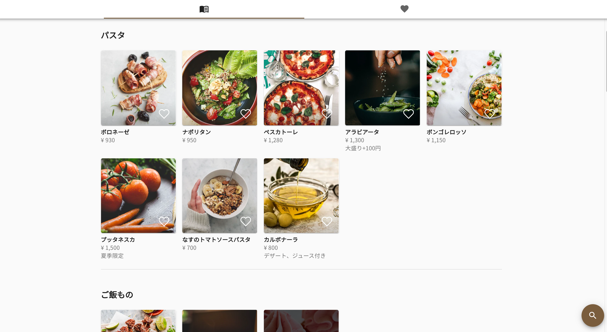

飲食店向けのメニュー電子化サービス「[GoodMenu(グッドメニュー)](https://goodmenu.io)」の β 版を 3 月 10 日にリリースしました。

本サービスでは、紙メニューを電子化することで店舗・来店客の双方に様々なメリットを提供します。
コロナ禍で苦しむ飲食業界の一助になればと考えています。

## 何ができるのか

本サービスでできることは二つあります。

一つ目は、QR コードで読み込むタイプの電子メニューを作成できることです。
こちらは、店内において来店客が利用する状況を想定しています。

二つ目は、Web に公開するオンラインメニューを作成できることです。
こちらは、自宅等においてテイクアウト用のメニューを閲覧する状況を想定しています。

システム構築にあたっては、利用者に快適な操作感を提供するために、
シングルページアプリケーションと呼ばれる最新技術を全面採用しました。
これにより、わずらわしいアプリのインストールを不要としながらも、
ネイティブアプリと同等の快適な操作感を実現しました。

## 何がいいのか

- 感染予防対策になる
- 新規顧客を集客できる
- メニューの更新が容易になる（料金変更、売り切れ対応）
- メニューの維持が容易になる（消毒、汚損対応）
- メニューの閲覧が容易になる（複数人での閲覧、大量のメニュー閲覧が容易）

## いくらするのか

メニュー数などに応じて、無料・月額 500 円・月額 1,500 円の３つのプランから選択できます。
自動化とクラウドの活用により低コストを実現しました。

## どうすれば使えるのか

新規登録ページからご登録いただくことで、即日でご利用いただけます。

https://owner.goodmenu.io/signup

## GoodMenu 公式 URL

https://goodmenu.io/
